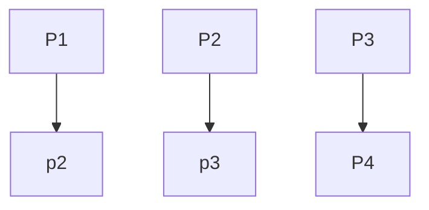

On day 3 we worked with the service desk and got a broad overview of how they work as a team and looked at all the different areas of service manageent and the importance of the various roles that threy have. Firstly, we went through a power poiny explaining how the whole department works. It explained the process of tickets and how to prioritise them bases on serverity into 4 caetgories. Each category related to a time frame in which Waterstons could fix the problem. We then went to work with the backups team who showed us what they do and how they use software to backup software and data that clients have. The backups team then work through a series of problems each day. We then spoke to somoeone on frontline support who had the job of prioritising and categorising each ticket that came in. We then spoke to various people who acctually dealt with the tickets that came in and attempted to fix problems that clients may have. The internal IT team then took us in the server room and showed us round to give us an undertanding on how the systems in Waterstons work and how they all connect togteher. They told us about their role and what they do on a day-day basis.

